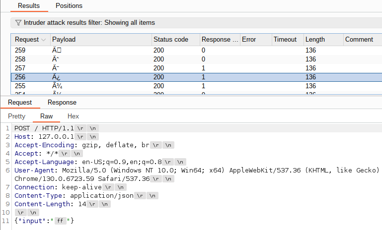

# Burp JSON Unicode-Escaper

Burp Extender providing JSON Unicode-escaping/unescaping capabilities (As defined in [RFC 8259 Section 7](https://datatracker.ietf.org/doc/html/rfc8259#section-7)).

The extender works with both Burp Suite Community and Burp Suite Professional. This extender was developed using the Burp Montoya API, and therefore can only be used on versions of Burp Suite that include this.

## Table of Contents

* [Building and Loading the Extender](#building-and-loading-the-extender)
  * [Building](#building)
  * [Loading](#loading)
* [Usage](#usage)
  * [Functionality Overview](#functionality-overview)
  * [Manual Escaper/Unescaper Tab](#manual-escaperunescaper-tab)
  * [Context Menu Items](#context-menu-items)
  * [Intruder Attacks](#intruder-attacks)
  * [Escaping/Unescaping Methods](#escapingunescaping-methods)
  * [Settings Tab](#settings-tab)
    * ["JSON Unicode-escape custom chars" Settings](#json-unicode-escape-custom-chars-settings)
    * [Global Settings](#global-settings)
    * [Import/Export/Reset Settings](#importexportreset-settings)
* [Known Issues/Shortcomings](#known-issuesshortcomings)
  * [Intruder Attack Payloads Containing Unicode Text](#intruder-attack-payloads-containing-unicode-text)
  * [Unicode-Escape Custom Characters Options for Intruder Attacks](#unicode-escape-custom-characters-options-for-intruder-attacks)
  * [Unescaping Unicode in Request URL and Headers](#unescaping-unicode-in-request-url-and-headers)
  * [Processing Unicode Surrogates](#processing-unicode-surrogates)
  * [Context Menu Items in Intruder-&gt;Payloads Window](#context-menu-items-in-intruder-payloads-window)
* [Copyright](#copyright)

## Building and Loading the Extender

### Building

**Note:** Building the extender is not necessary, as a prebuilt JAR file is available on the [Releases](https://github.com/Bort-Millipede/burp_JSON_Unicode-Escaper/releases) page. But if a manually-built extender is preferred (ex. to incorporate code changes not included in the latest release jar), provided here are the build instructions.

Requires OpenJDK 17+ and Gradle 8+. Higher OpenJDK versions should also work (although this has not been tested). The official Oracle JDK should also work (although this has not been tested). Lesser versions of OpenJDK and Gradle have not been tested and should not be assumed to work.

1. Clone the Burp_JSON_Unicode-Escaper repository.
2. Open a terminal and navigate to the ```Burp_JSON_Unicode-Escaper``` directory.
3. Issue the following command to compile the extension and create the extension jar file (named ```Burp_JSON_Unicode-Escaper-VERSION.jar```): ```gradle fatJar```

### Loading

Load the ```Burp_JSON_Unicode-Escaper-VERSION.jar``` extender jar file into Burp Suite with type **Java**.

## Usage

The extender leverages the third-party [JSON in Java (org.json)](https://github.com/stleary/JSON-java) library for JSON processing when necessary.

### Functionality Overview

This extender's functionality includes:

* **Manual Escaper/Unescaper Tab:** For escaping and unescaping data manually in a custom Decoder-like tab. Functionality for pasting in files for escaping/unescaping, as well as functionality for copying escaped/unescaped data to files, is included.
* **Context Menu Items:** For escaping and unescaping data in requests/responses on-demand within various Burp tools. Highlighted text can also be sent directly to the manual Escaper/Unescaper tab.
* **Intruder Payload Processors:** For automatically escaping/unescaping payloads during Intruder attacks.

### Manual Escaper/Unescaper Tab


This tab is available under the "JSON Unicode-Escaper" tab and is intended to be similar to the native Burp Suite ```Decoder``` tab. Data can be sent to this tab via the following methods:

* Pasted from the system clipboard: This can be done using ctrl+v or by clicking the ```Paste From Clipboard``` button.
* Via the ```Send to Manual Escaper/Unescaper``` context menu item: highlighted data (this is required) from requests/responses can be sent to the tab this way.
* From files using the ```Paste From File``` button displayed in the tab.

A drop-down menu is displayed for the user to choose which processing method will be used. The processed data displayed in the output area can then be:

* Copied to the system clipboard:
  * All or specific data by highlighting data and using ctrl+c; or
  * All data by clicking the ```Copy Escaped Output To Clipboard```/```Copy Unescaped Output To Clipboard``` button.
* Copied to a file: by clicking the ```Copy Escaped Output To File```/```Copy Unescaped Output To File``` button.

### Context Menu Items


This extender adds context menu items for requests and responses. These menu items provide on-demand escaping/unescaping of highlighted text.

* Within regular editors that are editable (ex. Repeater request, Proxy intercepted response, etc.), highlighted text is automatically replaced by the escaped/unescaped text.
* Within read-only editors (ex. proxy history), the escaped/unescaped text is displayed in a pop-up window (example below).
  * The output can then be copied to the system clipboard by clicking the ```Copy Full Value To Clipboard``` button, or by manually selecting text and then using ctrl+c.
  * Specifically for unescaping: if the unescaping fails, an error will be displayed in the pop-up and the original unprocessed value will be displayed.


The extender also adds a ```Send to Manual Escaper/Unescaper``` context menu item for sending highlighted text directly to the manual Escaper/Unescaper tab.

**NOTE:** Content menu items are NOT added to the ```Intruder```->```Payloads``` window (see Known Issues/Shortcomings section below).

### Intruder Attacks


To automatically escape/unescape attack payloads, configure an Intruder attack as normal. Then, add a new rule under the ```Payloads```->```Payload processing``` section. Select ```Invoke Burp extension``` and select the appropriate escaping/unescaping method from the drop-down menu. During the attack itself, each attack payload will be processed through the extender and replaced in the request before sending it off to the server.

**Note:** When using the ```JSON Unicode-escape custom chars``` escaping method for Intruder attacks, some consideration should be taken when changing options during a live running Intruder attack (See the Known Issues/Shortcomings section below).

### Escaping/Unescaping Methods

Only Unicode within the [Basic Multilingual Plane](https://en.wikipedia.org/wiki/Plane_(Unicode)#Basic_Multilingual_Plane) is currently supported (4 hexadecimal digits per character). Unicode beyond 4 hexadecimal digits is not currently supported.

* ```JSON-unescape```: Unescape any escaped characters (such as \n or \u0022) in payload.
  * If invalid escape sequences are detected (ex. \y, \u0h00, \u000, \\), the unescaping will fail and the processed data will be unchanged.
  * Otherwise, this method mostly ignores any unescaped characters (see ```Settings Tab```->```Global Settings``` section below for an explanation of an available global setting that partially affects this behavior). Regardless, it is recommended to only use this method on data that is fully escaped whenever possible.
* ```JSON-escape key chars```: Only escape JSON "key" characters, which includes:
  * control characters (0x00 - 0x1f)
  * double-quotes
  * backslashes
  * some high-ASCII characters (ex. 0x80-0x9f: these are not included in the RFC, but the JSON in Java library automatically escapes these characters for unknown reasons)  
  Characters with reserved two-character representations (ex. \n, \", etc.) will be escaped as such. All other appropriate characters will be escaped using Unicode-escaping (ex. \u0000 for null byte, etc.).
* ```JSON Unicode-escape key chars```: Only Unicode-escape JSON "key" characters, which includes:
  * control characters (0x00 - 0x1f)
  * double-quotes
  * backslashes
  * some high-ASCII characters (ex. 0x80-0x9f: these are not included in the RFC, but the JSON in Java library automatically escapes these characters for unknown reasons)  
  All appropriate characters will be escaped using Unicode-escaping (ex. \u0022 for double-quote, \u000a for newline, etc.).
* ```JSON Unicode-escape all chars```: Unicode-escape all characters (using \uXXXX format, where XXXX is the 4-digit Unicode hexadecimal value for the character).
* ```JSON Unicode-escape custom chars```:  Unicode-escape only specific characters (using \uXXXX format, where XXXX is the 4-digit Unicode hexadecimal value for the character). This option must be configured via the global Settings menu (explained in the ```Settings Tab```->```"JSON Unicode-escape custom chars" Settings``` section below).  
  **Note:** Using completely default settings and without any actual configuration from the user, this method will perform identically to the ```JSON Unicode-escape key chars``` method.

### Settings Tab


&nbsp;  


The extender provides a Settings tab containing various configuration options for the extender.

#### "JSON Unicode-escape custom chars" Settings

This section in the Settings tab configures specific options for the ```JSON Unicode-escape custom chars``` escaping method provided throughout the extender.

The exact characters that will be escaped can be defined two exclusive ways:

* ```Characters```: The specific characters that will be escaped should be explicitly entered into the ```Characters to JSON Unicode-escape``` field.
  * The characters to escape are updated in real-time (and therefore the first button below the field is automatically disabled).
* ```Hexdecimal numbers/ranges```:
  * The characters to be escaped should be specified via their 4-digit hexadecimal value (ex. 003c for ```<```).
  * Character ranges can also be specified (ex. 0030-003f for 30,31,32,33,34,35,36,37,38,39,3a,3b,3c,3d,3e,3f)
  * Characters/ranges are comma-delimited (ex. 002f,0030-003e,004c-4e,0100-0111)
  * The characters to escape are NOT updated in real-time: The user must click the "Update Escape Chars" button to commit changes.
    * The entered range(s) are immediately validated, and any invalid ranges are highlighted in red with an error message displayed to the left of the buttons. Changes are not committed until the error(s) are resolved.

Characters are automatically sorted and deduplicated by the extender, and therefore characters/ranges can be entered in any order in the field. For the ```Characters``` option, the ```Deduplicate & Sort``` button can be used to present the explicitly-defined escape characters more cleanly.

Which switching between the ```Characters``` and ```Hexdecimal numbers/ranges``` options, the values currently displayed in the ```Characters to JSON Unicode-escape``` field will be automatically converted between characters and ranges. The resulting values will be automatically sorted and deduplicated.

* Example: a specified ```0000-ffff``` range will be automatically converted into the entire Basic Multilingual Plane character set in ascending order, and vice versa.

Characters and ranges can be pasted directly into the field.

* For characters, this can be done by using ctrl+v or by clicking the "Paste" button. 
* For ranges:
  * For ranges themselves, these can be pasted from the system clipboard directly into the field using ctrl+v.
  * For explicit characters, these can be automatically converted into ranges and pasted into the field by using the ```Paste Text as Range(s)``` button.

Lastly, the ```Automatically include JSON key characters``` option allows the user to specify whether the JSON "key" characters (0x00-0x1f, ```"```, ```\\```) should be automatically included in the list of escape characters. This option is also updated in real-time.

**Note for Intruder attacks:** Because all of the above options are updated in real-time, some consideration should be taken when changing options during a live running Intruder attack (See the "Known Issues/Shortcomings"->"Unicode-Escape Custom Characters Options for Intruder Attacks" section below).

#### Global Settings

* ```Fine-tune unescaping to avoid errors```: ```JSON-unescape``` mostly ignores any unescaped characters. However, attempting to unescape certain characters (namely ```"```) that are already unescaped will cause the whole unescaping operation to fail. When enabled, this option will perform some preprocessing on the inputted data before reattempting to unescape it.

* ```Verbose logging in Extension "Output"/"Errors"```: This option provides additional logging by the extension within the ```Extension```->```Output``` and ```Extension```->```Output``` tabs. This is provided as a courtesy.

#### Import/Export/Reset Settings

These buttons allow users to export their settings configured in the Settings tab to a JSON-formatted file. That same file can then be imported back into the extender at any time. Lastly, users can quickly reset the extender back to default settings if desired.

Minimal validation is currently performed on settings JSON files being imported. If invalid (incorrectly-formatted) JSON is imported, the extender will abort the import. If individual settings themselves contain errors, the extender will only import individual settings that pass validation (if any). Some import errors will be displayed in the Settings tab below the Settings buttons, while all errors will be logged to the ```Extender```->```Errors``` tab.

## Known Issues/Shortcomings

### Intruder Attack Payloads Containing Unicode Text

It is recommended that attacks utilizing payloads containing raw Unicode text (0x100-0xffff) and high-ASCII text (0x7f-0xff) be saved to a file and added to the attack by loading the file.

The "Paste" button (for pasting text from the clipboard) and the "Enter a new item" entry field in the "Payloads" tab of Intruder attacks do not properly handle the entry of Unicode text, and possibly high-ASCII text as well. These methods appear to interpret the pasted/entered text as ASCII, and therefore do not interpret the full Unicode value properly. In other cases, some of the affected characters appear to get replaced with the 0xfffd character by Burp. Therefore, payloads containing Unicode text that are added to an attack using the button/field may not be correctly added, and by extension may be incorrectly interpreted and processed by the extender.

On the contrary, the ```Load ...``` button for loading payload(s) from a file appears to handle all text entry correctly. While Unicode text and high-ASCII text added via this method will not display correctly in the "Payload settings" menu or in the ```Payload``` column in the Intruder attack results, the text should be interpreted and processed correctly by the extender during the attack. The text should also be displayed correctly in the outgoing request(s). 



### Unicode-Escape Custom Characters Options for Intruder Attacks

The settings in the ```"JSON Unicode-escape custom chars" Settings``` section are updated in real-time, and therefore will directly affect any live Intruder attacks. This is due to the way that the options for the ```JSON Unicode-escape custom chars``` escaping method are set within the extender by the Settings menu. It is HIGHLY RECOMMENDED that these options NOT be modified during a live running Intruder attack.

### Unescaping Unicode in Request URL and Headers

Unescaping Unicode values (0x100-0xffff) in the request URL or headers is not recommended. This is because Unicode contained in these areas is usually encoded via different 3-byte scheme, rather than a the 4-digit hexadecimal scheme. Unescaping Unicode values in these parts of the request can produce undesired results.

### Processing Unicode Surrogates

It is recommended that Unicode surrogate characters (0xd800-0xdfff) be added to the extender's escape "JSON Unicode-escape custom chars" setting, primarily if there is any likelihood that the surrogate characters will be leveraged during Burp Suite usage.

The character range 0xd800-0xdfff are called the Unicode "Surrogates" and intentionally contain unrenderable data. Burp Suite often replaces these raw values with single ```?``` characters (with the possible exception of 0xdbff and 0xdc00).

### Context Menu Items in Intruder->Payloads Window

If data needs to be escaped/unescaped in the ```Intruder```->```Payloads``` window prior to launching the attack, it is recommended that the user either:

* Perform the escaping/unescaping prior to sending the request to Intruder; or
* Copy the data from the ```Intruder```->```Payloads``` window to the manual Escaper/Unescaper tab, perform the escaping/unescaping, then manually copy/paste the processed data back into the ```Intruder```->```Payloads``` window prior to launching the attack.

The Burp Montoya API does not currently offer methods for performing in-place editing of text/data in the ```Intruder```->```Payloads``` window. Therefore, the context menu items provided by this extension are NOT current available in the ```Intruder```->```Payloads``` window. If the required methods/functionality are added to the API at a later time, the context menu items may be implemented later for the ```Intruder```->```Payloads``` window.

## Copyright

Copyright (C) 2024, 2025 Jeffrey Cap (Bort_Millipede)

